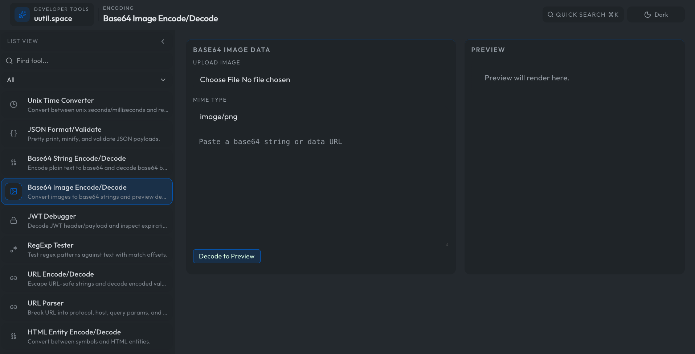

# uutil.space

Developer tooling workspace for parsing, formatting, converting, encoding, and debugging data in one place.



Repository: `git@github.com:nearbycoder/uutil.space.git`

## Clone

```bash
git clone git@github.com:nearbycoder/uutil.space.git
cd uutil.space
```

## Stack

- TanStack Start + TanStack Router
- React + TypeScript
- Tailwind CSS
- Bun

## Features

- 40+ developer utilities (JSON/YAML/CSV/PHP/SQL/encoding/hash/diff/preview tools)
- Per-tool routed pages (`/tools/:toolId`)
- Query-param input prefill + autorun support
- Command palette quick switch (`Cmd/Ctrl + K`)
- Fixed icon/list sidebar and responsive/mobile layouts
- Dark/light mode toggle with persisted preference

## Development

```bash
bun install
bun run dev
```

App runs at `http://localhost:3000`.

## Build

```bash
bun run build
bun run start
```

## Quality

```bash
bun run test
bun run lint
bun run format
bun run check
```

## Project Structure

- `src/routes/` route files and UI pages
- `src/components/` reusable UI components
- `public/` static assets
