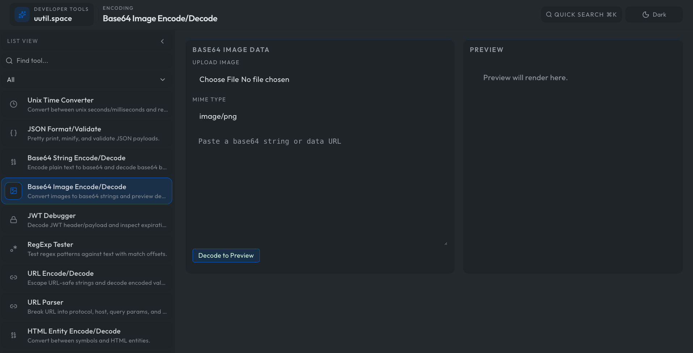

# uutil.space

Developer tooling workspace for parsing, formatting, converting, encoding, and debugging data in one place.



Repository: `git@github.com:nearbycoder/uutil.space.git`

## Clone

```bash
git clone git@github.com:nearbycoder/uutil.space.git
cd uutil.space
```

## Stack

- TanStack Start + TanStack Router
- React + TypeScript
- Tailwind CSS
- Bun

## Features

- 72 developer utilities, including JSON Schema validation, text redaction, mock data, color contrast, and a visual cron builder
- Per-tool routed pages (`/tools/:toolId`)
- Query-param input prefill + autorun support
- Command palette quick switch (`Cmd/Ctrl + K`)
- Fixed icon/list sidebar and responsive/mobile layouts
- Dark/light mode toggle with persisted preference
- Local-first processing: utility inputs stay in the browser
- Favorites and recent tools in the sidebar and workspace
- Smart paste detection and output-to-tool transfers
- Local presets, named scratchpads, and opt-in action history
- Shareable recipes with settings by default; input sharing requires explicit opt-in
- Drag a UTF-8 file into a text area, batch-transform files, and download results
- Per-tool built-in examples and quick help
- Installable app with opt-in offline preparation, update controls, and removal

## Workspace privacy and limits

Open **My workspace** for saved items and file workflows. History is **off by default**. Enabling it retains action inputs and settings locally, including any secrets, for 1, 7, or 30 days. Turning it off deletes history. Presets exclude inputs unless opted in. Recipes use URL fragments and do not auto-run; anyone with the link can read included data.

Saved items are browser-local, not account-synced or encrypted. Browser data clearing can remove them. Export important snippets. Limits: 50 presets, 50 scratchpads, 50 history entries, 100 KB per saved field, and a 2 MB workspace. Batch processing supports 10 UTF-8 files up to 1 MB each. Schema validation supports drafts 4/6/7 with local references and a three-second worker deadline. Redaction is pattern-based and requires human review.

Offline preparation downloads app assets and anonymous tool pages, never user inputs or query-bearing page responses. Enable it before disconnecting. Updates wait for an explicit reload or for old tabs to close. Installation uses the browser's Install / Add to Home Screen menu; on iOS, Safari's Share menu. Offline files can be removed independently of saved workspace data.

## Development

```bash
bun install
bun run dev
```

App runs at `http://localhost:3000`.

## Build

```bash
bun run build
bun run start
```

## Quality

```bash
bun run test
bun run check
bun run build
bun run lint
bun run format
```

Production-browser regressions (requires `agent-browser` on PATH):

```bash
bun install --frozen-lockfile
bun run build
PORT=3103 bun run start
# In another terminal:
TEST_URL=http://localhost:3103 node scripts/verify-workspace.mjs
TEST_URL=http://localhost:3103 node scripts/verify-layout.mjs
TEST_URL=http://localhost:3103 node scripts/verify-mobile-navigation.mjs
TEST_URL=http://localhost:3103 node scripts/verify-offline.mjs
```

Keep both lockfiles synchronized when updating dependencies. The committed Bun lockfile is compatible with both Bun 1.3.14 (used by the earlier Railway builder) and Bun 1.4.0. The offline Vite plugin emits the worker before Nitro indexes public assets; generating it after the build would leave `/sw.js` unserved.

## Project Structure

- `src/routes/` route files and UI pages
- `src/components/` reusable UI components
- `public/` static assets
