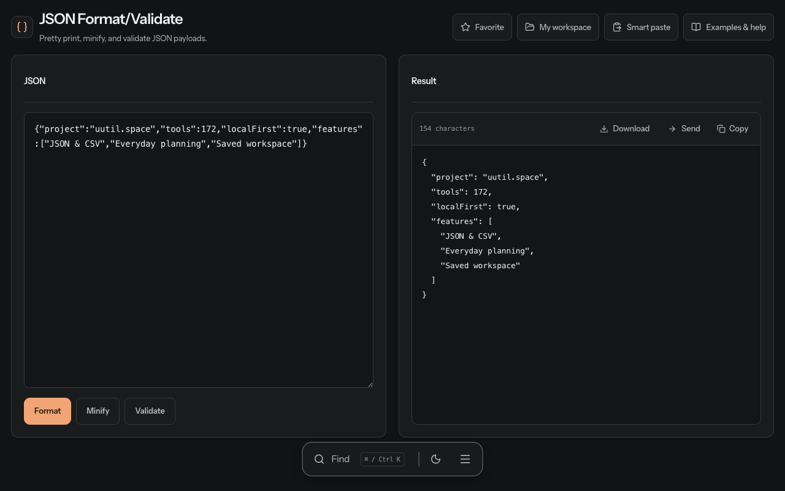
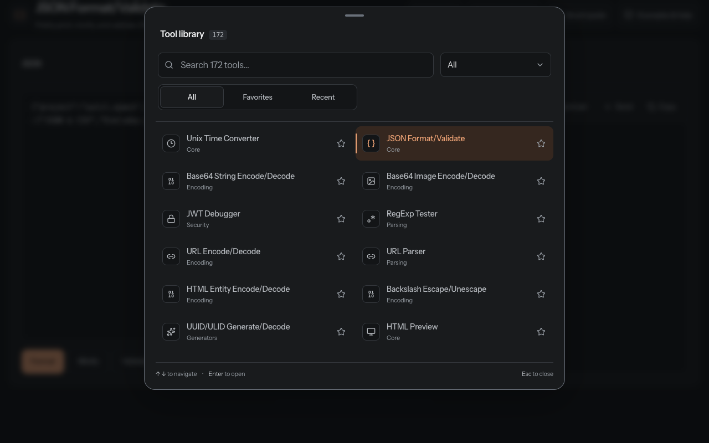
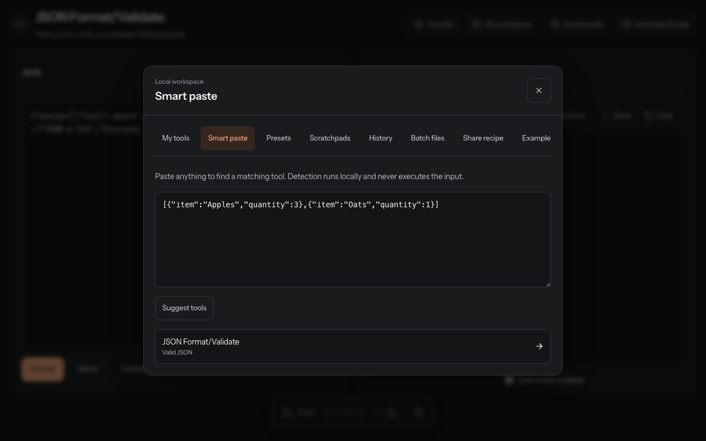
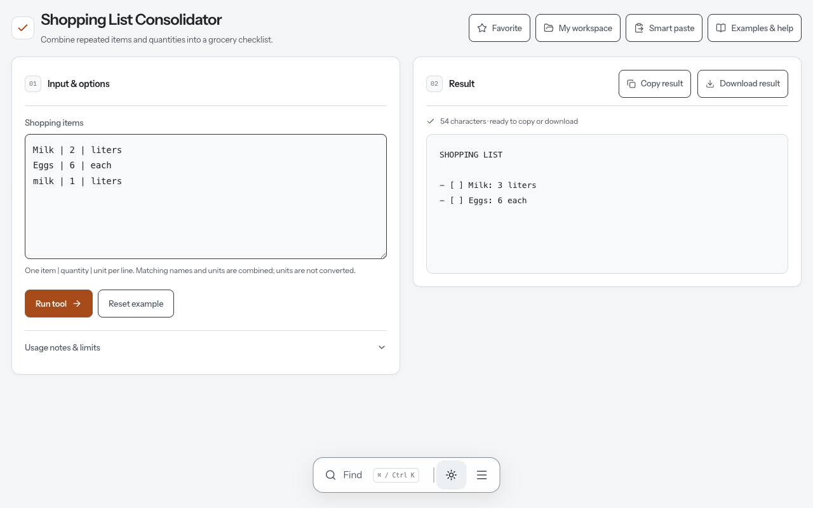
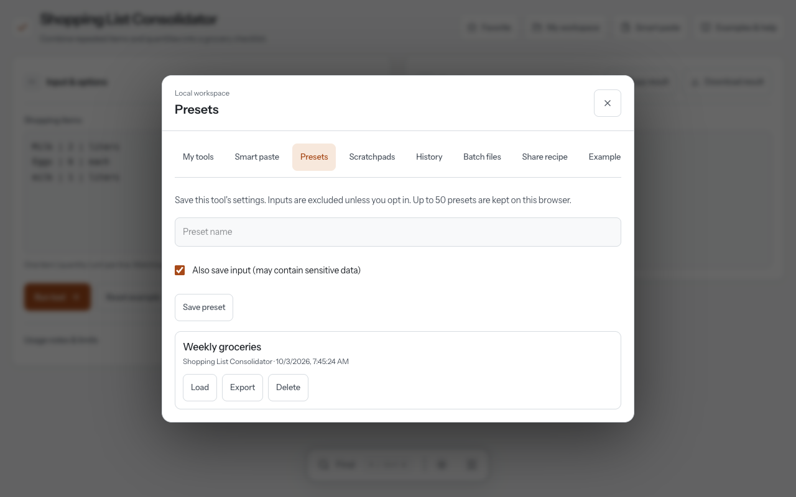
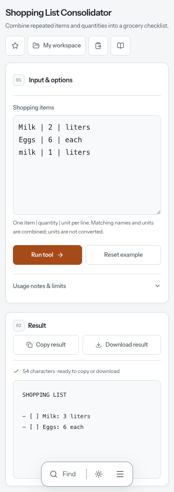

# uutil.space

**172 browser-local tools for everyday planning and developer workflows.** Format JSON, work with CSV, inspect text, build a grocery list, plan your week, and keep useful settings in one workspace.

[Open the app](https://uutil.space) · [Walkthroughs](#walkthroughs) · [Run locally](#development) · [Privacy and limits](#privacy-and-limits)



## Explore the toolkit

Use **Find** in the floating dock or press **⌘/Ctrl + K** to search. The dock's menu button opens the tool library, with category filters, **Favorites**, and **Recent** views. Star a tool to keep it close; every tool also has a direct `/tools/:toolId` URL.



| What you need | A few tools to try |
| --- | --- |
| Everyday planning | [Shopping List Consolidator](https://uutil.space/tools/shopping-list), [Daily Task Planner](https://uutil.space/tools/task-capacity), [Reading Plan Calculator](https://uutil.space/tools/reading-plan) |
| Budgets and comparisons | [Shared Expense Settler](https://uutil.space/tools/expense-settlement), [Subscription Cost Audit](https://uutil.space/tools/subscription-costs), [Unit Price Comparison](https://uutil.space/tools/unit-price) |
| JSON and CSV | [JSON Format/Validate](https://uutil.space/tools/json-format-validate), [JSON to CSV](https://uutil.space/tools/json-to-csv), [CSV Pivot Table](https://uutil.space/tools/csv-pivot-table) |
| Text and encoding | [Text Diff Checker](https://uutil.space/tools/text-diff), [Base64 String Encode/Decode](https://uutil.space/tools/base64-string), [Unicode Inspector](https://uutil.space/tools/unicode-inspector) |
| Web and developer work | [JWT Debugger](https://uutil.space/tools/jwt-debugger), [HTTP Request Inspector](https://uutil.space/tools/http-request-inspector), [CSS Grid Planner](https://uutil.space/tools/css-grid-planner) |

The library includes 20 everyday productivity tools alongside formatting, conversion, parsing, encoding, security, and generator utilities. Use the dock's sun/moon button to switch between light and dark mode; your preference is saved locally.

## Walkthroughs

### 1. Format JSON and turn it into CSV

1. Open [JSON Format/Validate](https://uutil.space/tools/json-format-validate).
2. Paste this array into the **JSON** field:

   ```json
   [{"item":"Apples","quantity":3},{"item":"Oats","quantity":1}]
   ```

3. Select **Format** to pretty-print it. **Minify** compacts it; **Validate** checks whether it is valid JSON.
4. In the result panel, select **Send**, search for **JSON to CSV**, and choose it. The formatted output becomes the destination tool's input. Review it, then select **Convert**.
5. Use **Copy** or **Download** to take the CSV with you:

   ```csv
   item,quantity
   Apples,3
   Oats,1
   ```

For another starting point, open **Examples & help** and select **Restore built-in example**. This replaces the current inputs and settings. Some tools calculate as you type; others use an explicit action button.

### 2. Let smart paste suggest a tool

1. Select **Smart paste** in the tool header (the clipboard icon on narrow screens).
2. Paste the JSON array from the first walkthrough.
3. Select **Suggest tools**. The app recognizes valid JSON and suggests **JSON Format/Validate**.
4. Choose the suggestion to load your input, then select an action in the tool.

Detection happens in your browser. Loading a suggestion or sending output to another tool does not run it automatically.



### 3. Combine a grocery list

1. Open [Shopping List Consolidator](https://uutil.space/tools/shopping-list), or search for it in **Find**.
2. Enter one `item | quantity | unit` per line:

   ```text
   Milk | 2 | liters
   Eggs | 6 | each
   milk | 1 | liters
   ```

3. Select **Run tool**. Matching item names and units are combined, ignoring case:

   ```text
   SHOPPING LIST

   - [ ] Milk: 3 liters
   - [ ] Eggs: 6 each
   ```

4. Select **Copy result** or **Download result** to use the checklist elsewhere. **Reset example** restores the sample; **Usage notes & limits** explains the input rules.

Units are combined as entered, without conversion. Keep `liters` and `ml` separate or convert them first.



### 4. Save a setup and share a recipe

1. With the grocery list entered, open **My workspace → Presets**.
2. Name the preset `Weekly groceries`. Presets save settings by default. For this input-only tool, check **Also save input (may contain sensitive data)** to include the list.
3. Select **Save preset**. Use **Load** to restore it later, **Export** for a backup, or **Delete** to remove it. Review loaded values before running.
4. To share a tool setup, open **Share recipe** in the workspace and select **Create recipe link**, then **Copy recipe link**. Settings are included by default; check **Include input in the link (review for secrets first)** only when you want to share the data too.

Recipes store their contents in the URL fragment and never auto-run. Anyone with the link can read included input. Saved presets remain in the current browser; sharing a link does not sync your workspace.



### 5. Process files and prepare for offline use

- **One file:** drag a UTF-8 text file into a tool's text area, review the input, then run the tool.
- **A batch:** open **My workspace → Batch files**, choose an operation such as **JSON format** or **CSV to JSON**, then select **Choose files** or drop files into the panel. Each file gets its own result or error. Use **Download result** for one file or **Download all results** for the collection.
- **Offline:** open **My workspace → Offline & install** while connected and select **Enable offline mode**. Wait for preparation to finish before disconnecting. This downloads app assets and anonymous tool pages.
- **Install:** use the panel's **Install app** button when available, or your browser's **Install app / Add to Home Screen** menu. On iPhone or iPad, use Safari's **Share → Add to Home Screen**.

The offline panel also offers **Check for updates**, **Update app and reload** when an update is ready, and **Remove offline files**. Removing offline files leaves saved workspace data in place.

## On your phone

Tools stack their input and result panels on narrow screens. The floating dock keeps search, theme switching, and the tool library within reach. Scroll down to see results; **My workspace** opens the same saved-item and file workflows as on desktop.



## Privacy and limits

Tool inputs and file transformations are processed locally in the browser. Saved items are browser-local, without account sync or encryption. Clearing browser data can remove them, so export important presets and snippets. The production site also loads a page analytics script.

- **Presets and scratchpads:** up to 50 of each, 100 KB per saved field, within a 2 MB workspace. **Scratchpads** hold named snippets you can reuse, export, or send to a tool.
- **History:** off by default. Opting in retains action inputs and settings locally, including any secrets, for 1, 7, or 30 days, up to 50 entries. Turning it off deletes history. **Recent** tracks opened tools without storing their inputs.
- **Batch files:** up to 10 UTF-8 files, each up to 1 MB. Each file is processed independently.
- **Sharing:** presets and recipes exclude inputs unless you opt in. Recipe links contain readable data, so review them before sharing.
- **Offline storage:** preparation excludes user inputs and query-bearing page responses. Browser storage can be evicted. Updates wait for an explicit reload or for old tabs to close.
- **Tool-specific limits:** schema validation supports drafts 4/6/7 with local references and a three-second worker deadline. Redaction is pattern-based and needs human review. Check each tool's help for its own constraints.

Tool URLs also support query prefill with `input`, `input2` through `input6`, or an `inputs` JSON array, plus `action` and `autorun` (alias `run`). **Query input defaults to autorun**; set `autorun=false` to review it first. Query strings can appear in server logs and browser history. Use **Share recipe** for deliberate sharing and keep secrets out of URLs.

## Development

The app uses **TanStack Start + TanStack Router**, **React + TypeScript**, **Tailwind CSS**, and **Bun**, with Nitro serving the production build.

Use Bun and a Node.js version accepted by `package.json`: `^22.22.2`, `^24.15.0`, or `>=26.0.0`.

```bash
git clone git@github.com:nearbycoder/uutil.space.git
cd uutil.space
bun install --frozen-lockfile
bun run dev
```

Open [localhost:3000](http://localhost:3000).

### Production build

```bash
bun run build
bun run start
```

Set `PORT` when you need a specific server port, for example `PORT=3103 bun run start`.

### Quality checks

```bash
bun run test
bunx tsc --noEmit
bun run check
bun run lint
bun run format
bun run build
```

`check` runs Biome's formatting, lint, and import checks; TypeScript checking is a separate command. The commands above check files without rewriting them.

Production-browser regressions require `agent-browser` on `PATH`. Start a production build with `PORT=3103 bun run start`, then run these in another terminal:

```bash
TEST_URL=http://localhost:3103 node scripts/verify-workspace.mjs
TEST_URL=http://localhost:3103 node scripts/verify-layout.mjs
TEST_URL=http://localhost:3103 node scripts/verify-mobile-navigation.mjs
TEST_URL=http://localhost:3103 node scripts/verify-offline.mjs
TEST_URL=http://localhost:3103 node --import tsx scripts/verify-all-local-tools.mjs
TEST_URL=http://localhost:3103 node scripts/verify-productivity.mjs
```

Keep `bun.lock` and `package-lock.json` synchronized when updating dependencies. The offline Vite plugin emits the service worker before Nitro indexes public assets; generating it after the build would leave `/sw.js` unserved.

### Project structure

| Path | Purpose |
| --- | --- |
| `src/routes/` | Routed tool pages and the main tool registry |
| `src/components/` | Tool UI, workspace panels, and shared controls |
| `src/lib/` | Converters, modular tools, saved workspace logic, and offline support |
| `public/` | App icons, fonts, manifest, and other static assets |
| `scripts/` | Browser regressions and offline build support |
| `docs/` | Release notes, verification records, and README screenshots |

See the [first](docs/local-tools-release.md), [second](docs/local-tools-second-release.md), [third](docs/local-tools-third-release.md), and [fourth](docs/local-tools-fourth-release.md) local-tool releases, plus the [everyday productivity release](docs/productivity-release.md), for detailed coverage and limits.

Screenshots were captured from [uutil.space](https://uutil.space) on October 3, 2026, using sample data at 1280 × 800 and 390 × 1100 viewports. To refresh them, follow the walkthroughs above, let dialogs finish animating, and replace the matching files in `docs/images/`.
